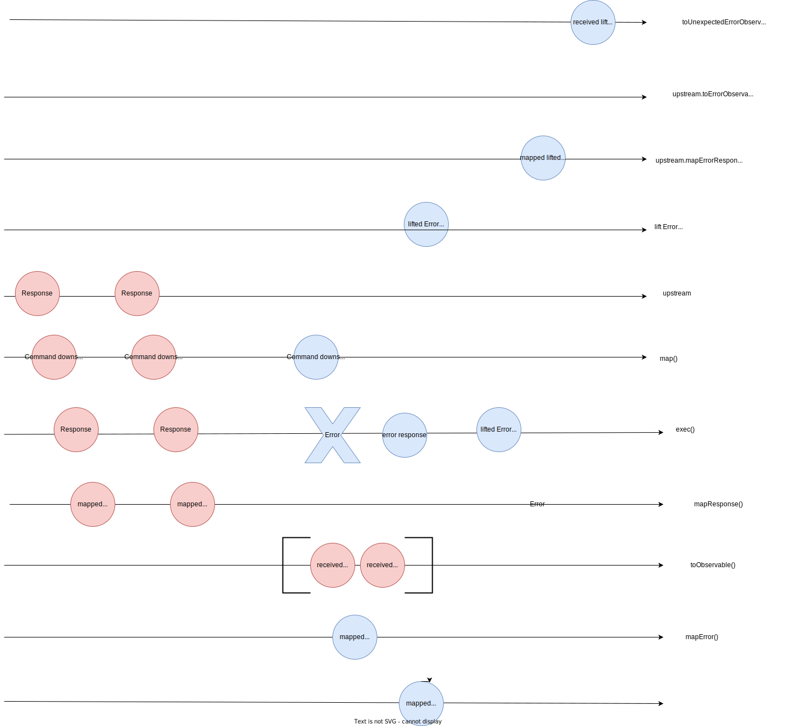

# mergeLink operator

the bufferLink operator allow you to chain a command to an observable of commands and concatenate responses in an array which is then emitted downstream, while specifying the error propagation.
to summaryze, you can generate multiple commands branching from one, the result of the operation in absence of error, is generated as an array of all commands responses. In case of an error, the execution stops where the error appeared, the error follows the error path, while awailables responses follow the normal path.

```typescript
import SagaSubject from "rx-saga";
import { bufferLink } from "rx-saga/operators";
import { IError } from 'rx-saga/error';
import MyBusImpl from './bus'
import { from } from "rxjs";


class Command {
    type = 'do_something';
    data: any;
    constructor(data) {
        this.data = data;
    }
}

class CommandError implements IError {
    type: string = 'error_command';
    data: any;
    previous: IError<any> | undefined;
    constructor(data: any, previous?: IError) {
        this.data = data
        this.previous = previous;
    }

}

class RecoverCommandError implements IError {
    type: string = 'unrecoverable_error';
    data: any;
    previous: IError<any> | undefined;
    constructor(data: any, previous?: IError) {
        this.data = data
        this.previous = previous;
    }
}

class RecoverCommand1 {
    type = 'recover_from_do_something1';
    data: any;
    constructor(data: any) {
        this.data = data;
    }
}
class RecoverCommand2 {
    type = 'recover_from_do_something2';
    data: any;
    constructor(data: any) {
        this.data = data;
    }
}

/**
 * mapError is where you will implement all the error treatment from the bus,
 * and define wich command to process to recover from handled errors.
 * note that any thrown error in this function will be treated in the unexpected error pipeline.
 */
const mapError = (err: CommandError) => {
    if(err.data === 1) {
        return new RecoverCommand1(err.data);
    } else {
        return new RecoverCommand2(err.data);
    }
}

/**
 * this function allow you to apply modification to the output response of the bus
 * after it has processed your command.
 * not that any thrown error in this function will be treated in the unexpected error pipeline.
 */
const mapResponse = (busResponse: any) => busResponse as {data: any};
/**
 * this function allow you to apply modification to the output response of the bus
 * after it has processed your error command.
 * note that any thrown error in this function will be treated in the unexpected error pipeline.
 */
const mapErrorResponse = (busResponse: any) => busResponse as {errorData: any};
/**
 * this function allow you to map the ouput of the first subject to a command, linking them together.
 * note that any thrown error in this function will be treated in the unexpected error pipeline.
 */
const map = (mappedResponse: {data: any}) => {
    mappedResponse.data + 1;
    return from([mappedResponse, mappedResponse, mappedResponse]);
}
/**
 * this function allow you to apply map the error response from the downstream Subject to an upstream error command.
 * note that any thrown error in this function will be treated in the unexpected error pipeline.
*/
const liftError = (mappedDownstreamErrorResponse: {errorData: any}) => {
    return new RecoverCommand1(mappedDownstreamErrorResponse.errorData)
};

const saga = new SagaSubject<
    Command,
    {data: any},
    CommandError,
    RecoverCommand1 | RecoverCommand2,
    {errorData:any}
>(new MyBusImpl(), mapError, mapResponse, mapErrorResponse);

/**
 * use the pipe function to chain operators, just like RxJs Observables
 */
const linkedSaga = saga.pipe(bufferLink(map, liftError, mapError, mapResponse, mapErrorResponse))

/**
 * toObservable() return an RxJs Observable wich output the responses of the bus, after it has processed your commands.
 * it eventually completes if saga.complete() is called.
 * always subscribe to the downstream for working flow, and upstream for error flow
 * note that it is possible to subscripbe to any intermediary subject for error or normal flow if desired
 */
const subscription = linkedSaga.toObservable().subscribe({
    next(value: {data: any}) {
        console.log(value)
    },
    complete() {
        subscription.unsubscribe();
    },
});

/**
 * toErrorObservable() return an RxJs Observable wich output the errors of the bus, and process the linked error command.
 * it eventually completes if saga.complete() is called
 * always subscribe to the downstream for working flow, and upstream for error flow
 * note that it is possible to subscripbe to any intermediary subject for error or normal flow if desired
 */
const subscriptionError = saga.toErrorObservable().subscribe({
    next(value: {errorData: any}) {
        console.log(value)
    },
    complete() {
        subscriptionError.unsubscribe();
    },
});

/**
 * toUnexpectedErrorObservable() outputs any error that does ot come from the bus, or any error from the bus while it
 * handles error commands.
 * it eventually completes if saga.complete() is called
 * always subscribe to the downstream for working flow, and upstream for error flow
 * note that it is possible to subscripbe to any intermediary subject for error or normal flow if desired
 */
const subscriptionUnexpectedError = saga.toUnexpectedErrorObservable().subscribe({
    next(value: any) {
        console.log(value)
    },
    complete() {
        subscriptionUnexpectedError.unsubscribe();
    },
});

/**
 * SagaSubject ressemble an RxJs Subject, and therefore accepts new values to process with it's next(value) function.
 */
saga.next(new Command(1));
saga.next(new Command(0));
saga.complete();
```

the marble diagram of the operator : 

